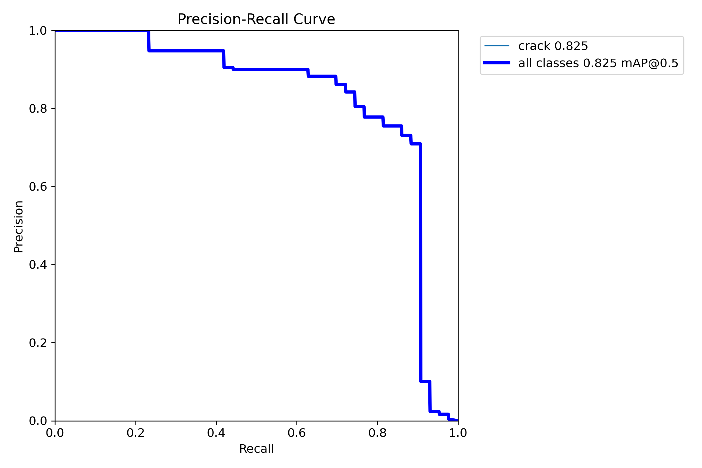

# Facade Crack Detection using YOLOv8
## Problem Statement
Facade cracks can indicate structural deterioration in buildings. 
Manual inspection is time-consuming and subjective.

This project develops a YOLOv8-based object detection model 
to automatically detect facade cracks from images 
to support early-stage structural inspection workflows.

Success criteria:
- Achieve strong detection performance (mAP@0.5 ≥ 0.75)
- Maintain reliable detection across lighting variations

## Dataset

Source: Roboflow  
Project: facade-cracks  
Format: YOLOv8  
Split: 80% Train / 20% Validation  
Classes: crack  
Dataset link : https://universe.roboflow.com/ahmad-younis-s-workspace/facade-cracks

## Model Configuration

Model: YOLOv8s  
Epochs: 50  
Image size: 640  
Batch size: 16  
Runtime: Google Colab (T4 GPU)

All annotations were reviewed for consistency.

## Results Summary

Final Performance:

- mAP@0.5: 0.825
- Strong precision-recall stability
- Reliable detection of visible cracks
- Minor misses on very thin hairline cracks

## Model Weights 
The trained model weights (best.pt) are available here:
[Download Model Weights](https://github.com/aesawy83-ai/FMP-Group2/releases/tag/%23M4U3))

## Reproduce in Google Colab

1. Open `notebooks/M4U3.ipynb` in Colab.
2. Runtime → Change runtime type → GPU.
3. Run all cells.
4. Training outputs will be saved in `/runs/detect/`.

## Reproducibility Proof

Last successful run: [27/2/2026]  
Runtime: Google Colab (T4 GPU)  
Epochs: 50  
Model: YOLOv8s  
Expected runtime: ~15–20 minutes

## Evidence

Training curves: `/results/curves/`  
Validation predictions: `/results/predictions_val/`  
New image predictions: `/results/predictions_new/`

## Governance & Limitations

This model is intended for inspection assistance only.
Human validation is required before structural decisions.

See:
- `/docs/error_analysis.md`
- `/docs/governance_checklist.md`

